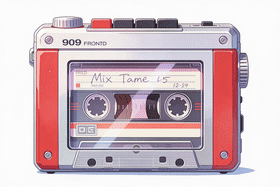

# WalkmanWidget

[**Download WalkmanWidget.dmg**](https://github.com/dragontpe/WalkmanWidget/releases/latest/download/WalkmanWidget.dmg)

A floating macOS desktop widget that looks like a vintage cassette Walkman. Controls Spotify playback via AppleScript with a looping tape fuzz audio layer on top.



## Features

- **Animated cassette** — GIF-based walkman with spinning tape reels
- **Spotify control** — play/pause, skip, rewind via AppleScript (accepts playlist URLs or URIs)
- **Tape fuzz layer** — real cassette hiss audio loop layered over your music, adjustable via FUZZ knob
- **Green LCD display** — scrolling track name marquee, side indicator, elapsed time, segmented progress bar
- **Side A/B flip mechanic** — 45-minute timer per side (configurable 30/45/60 min), flip prompt with animation
- **Floating widget** — always-on-top NSPanel, drag to reposition, no dock icon, menu bar toggle
- **Scanline overlay** — subtle CRT effect across the whole widget

## Prerequisites

- macOS 13+
- [Spotify](https://www.spotify.com/download/mac/) desktop app
- [XcodeGen](https://github.com/yonaskolb/XcodeGen) (`brew install xcodegen`)
- Xcode 15+

## Build & Install

```bash
cd WalkmanWidget
xcodegen generate
xcodebuild -project WalkmanWidget.xcodeproj -scheme WalkmanWidget -configuration Debug build
```

Copy the built app to Applications:
```bash
cp -R ~/Library/Developer/Xcode/DerivedData/WalkmanWidget-*/Build/Products/Debug/WalkmanWidget.app /Applications/
```

## Usage

1. Launch WalkmanWidget — a cassette walkman appears on your desktop
2. Click the **gear icon** (top right) to open settings
3. Paste a Spotify playlist URL or URI (e.g. `https://open.spotify.com/playlist/...`)
4. Click **Save & Reload Playlist**
5. Press **play** — Spotify starts with tape hiss layered on top
6. After 45 minutes, playback pauses with a **FLIP CASSETTE** prompt
7. Tap to flip to Side B and continue

## Controls

| Control | Action |
|---------|--------|
| Play/Pause button | Toggle Spotify playback + tape fuzz |
| Skip buttons | Next/previous track |
| Rewind/FF buttons | Jump 10 seconds back/forward |
| FUZZ knob (drag up/down) | Adjust tape hiss volume (0–100%) |
| Gear icon | Open settings (playlist URI, side duration, fuzz toggle) |
| Drag cassette image | Move the widget |
| Menu bar disc icon | Show/hide the widget |

## Settings

- **Spotify Playlist URI** — paste a URL or URI, both formats supported
- **Side duration** — 30 / 45 / 60 minutes per side
- **Tape fuzz enabled** — toggle the hiss layer
- **Always on top** — keep widget above other windows

## Project Structure

```
WalkmanWidget/
├── WalkmanWidgetApp.swift          # App entry point
├── AppDelegate.swift               # NSPanel + status bar setup
├── Views/
│   ├── WalkmanView.swift           # Main widget layout + overlays
│   ├── CassetteView.swift          # Animated GIF cassette display
│   ├── LCDView.swift               # Green LCD with track info
│   ├── TransportButtonsView.swift  # Play/pause/skip buttons
│   ├── FuzzKnobView.swift          # Rotary volume knob
│   └── SettingsView.swift          # Settings popover
├── Engine/
│   ├── SpotifyBridge.swift         # AppleScript Spotify commands
│   ├── TapeFuzzEngine.swift        # AVAudioPlayer tape hiss loop
│   └── PlaybackState.swift         # Central state machine
├── Models/
│   ├── SpotifyTrack.swift          # Track model
│   └── CassetteSide.swift          # Side A/B enum
├── Utilities/
│   └── NSPanelSetup.swift          # Floating panel + drag handle
└── Resources/
    ├── cassette_animated.gif       # Animated walkman with spinning reels
    └── tape_hiss.wav               # Looping cassette hiss audio
```

## Credits

- Cassette animation generated with AI video
- Tape hiss sample from [Archive.org](https://archive.org/details/Track1008) (CC BY-NC 3.0, Alex Lozupone)
- Built with SwiftUI, AppKit, AVFoundation
- Spotify controlled via AppleScript

## License

MIT
